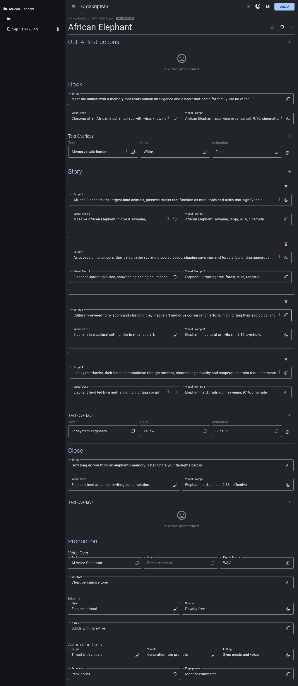

# OrgScriptMS

OrgScriptMS (Organism Script Management System) is a lightweight, open-source system designed to help manage and generate scripts for faceless channel brands.  
Originally built for Afro-futurist storytelling, it has been refactored to focus on generating **engaging, factual scripts about organisms** — plants, animals, or any other fascinating lifeforms.  
This tool blends science, culture, and storytelling to craft short-form scripts (e.g., for YouTube Shorts or TikTok) that grab attention and deliver captivating insights.

It combines an **Express backend** with an **Angular frontend**, designed for local use or private hosting on a remote server.

The original project is at [NewBen420/ScriptMS](https://github.com/newben420/scriptms)

---

## Features

- **Hierarchical Content Management**: Organize organism facts into a structured hierarchy (e.g., organism > scripts).
- **Editable JSON Script Files**: Store scripts as timestamped JSON files, allowing easy editing and versioning.
- **Responsive Web Interface**: Navigate seamlessly on any device with a collapsible navigation drawer.
- **Script Management Tools**: Add, edit, copy, and regenerate scripts to support iterative creative processes.
- **Local File System Storage**: Ensure persistence and accessibility of your work without relying on external databases.
- **Groq Integration**: Generate scripts using a powerful AI prompt that creates all aspects of a script given just the organism name and optional base ideas or instructions.
- **Production Notes**: Include voice-over, music, and automation details for a complete production pipeline.
- **Scientific & Cultural Balance**: Scripts highlight unique traits, ecological roles, survival strategies, cultural symbolism, and fascinating twists about organisms.
- **Optional Authentication**: Enable user/password protection to host the system privately on a remote server. Authentication settings are configurable via environment variables.
- **Accessible Aesthetic**: Designed for short-form doomscroll platforms — concise, witty, and curiosity-driven.

---

## Screenshot (Demo)

<p align="center">
  
</p>

---

## Technical Overview

### Backend

- **Framework**: [Express.js](https://expressjs.com/)
- **Features**:
  - RESTful API for managing scripts and hierarchical content.
  - Socket.IO integration for real-time updates.
  - File system operations for reading, writing, and deleting JSON files.
  - Groq integration for AI-powered script generation.

### Frontend

- **Framework**: [Angular](https://angular.io/)
- **Features**:
  - Responsive design with Material Design components.
  - Dynamic forms for editing script content.
  - Localization support using `@ngx-translate/core`.
  - Theme switching (light/dark mode).
  - Real-time updates via Socket.IO.

---

## Installation

### Prerequisites

- Node.js (v16 or later)
- A modern web browser

### Steps

1. Clone the repository:

   ```bash
   git clone https://github.com/newben420/org_script.git
   cd org_script
   ```

2. Install dependencies:

   ```bash
   npm install
   ```

3. Configure environment variables:

   - Create a .env file in the root directory.
   - Add the following variables, and update according to your specifications:

     ```sh
     PORT="3000"
     TITLE="OrgScriptMS"
     BRAND="OrgScript"
     PRODUCTION="true"
     FORCE_FAMILY_4="true"
     EXIT_ON_UNCAUGHT_EXCEPTION="true"
     EXIT_ON_UNHANDLED_REJECTION="false"
     PROD_URL="https://example.com" # url if you are hosting in production mode
     MAX_ALLOWED_FLOG_LOG_WEIGHT="5"

     GROQ_KEY=""
     GROQ_ENDPOINT="https://api.groq.com/openai/v1/chat/completions"
     GROQ_MODELS="deepseek-r1-distill-llama-70b" # pick any from below
     # allam-2-7b compound-beta compound-beta-mini deepseek-r1-distill-llama-70b gemma2-9b-it
     # llama-3.1-8b-instant llama-3.3-70b-versatile llama3-70b-8192 llama3-8b-8192
     # meta-llama/llama-4-maverick-17b-128e-instruct meta-llama/llama-4-scout-17b-16e-instruct
     # meta-llama/llama-guard-4-12b meta-llama/llama-prompt-guard-2-22m
     # meta-llama/llama-prompt-guard-2-86m mistral-saba-24b qwen-qwq-32b qwen/qwen3-32b
     # moonshotai/kimi-k2-instruct
     GROQ_REQUEST_TIMEOUT_MS="0"
     GROQ_MAX_RETRIES="4"
     GROQ_HTTP_TIMEOUT_MS="60000"
     GROQ_MAX_HISTORY_COUNT="5"

     DATA_POSTSTRING="default"

     AUTH="true" # whether to enable authentication or not
     AUTH_USER="bar" #auth username
     AUTH_PASS="one" #auth password
     AUTH_MAX_ATTEMPTS="3" # max failed auth attempts per IP address.
     AUTH_SESSION_SECRET="RYFGH324FU" # random string for express session secret
     ```

### Usage

1. Start the application:

   ```bash
   npm start
   ```

2. Access the application at http://localhost:3000/. Or whatever port you specify.

3. Workflow:

   - Add Organisms: Navigate to the "Organisms" section and create a new organism entry.
   - Generate Scripts: Use the Groq-powered AI to generate scripts by providing the organism name and optional base ideas/additional instructions.
   - Edit Scripts: Modify generated scripts directly in the editor.
   - Production Notes: Add voice-over, music, and automation details for a complete production pipeline.
   - Authentication (if enabled): Log in with your configured username and password before accessing the system.

---

## Project Structure

- **`/engine/`**: Core logic for data management, authentication,  Groq integration, and socket communication.

- **`/lib/`**: Utility functions and helpers.

- **`/model/`**: Type definitions for structured data (e.g., scripts, visuals).

- **`/site.js`**: Configuration and environment variables.

---

## Contributions

Contributions are welcome! If you have ideas for new features or improvements, feel free to open an issue or submit a pull request.

---

## License

This project is open-source and available under the MIT License.
